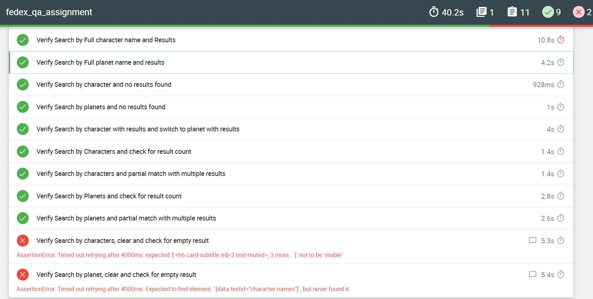

# Fedex QA Assignment
* [Description](#description)
* [Pre requisites](#pre-requisites)
* [Test Scenarios](#test-scenarios)
* [Test Execution](#test-execution)
* [Test Reports](#test-report)

## Description
This is the FedEx Digital International QA Engineer assessment. Web interface is tested through Cypress. Automation scripts is implemented using describe and IT block. Reportings is done via mocha.

## Pre-requisites
~~~bash
* node and npm should be installed (to verify run command (node -v , npm -v )
* Unzip the file if loading the code via attachement.
* open terminal.
* cd to unzipped folder /
* run the command 'npm install' to install the dependencies
~~~

## Test Scenarios
|Description    | Test | Expected |Pass/Fail|
|--------   |-------------|----------|----|
|Full Character Name and Search  | Enter complete star wars character name and click on search| Exact match results should be displayed. No duplication|Pass|
|Full Planet Name and Press Enter | Enter complete star wars planet name and press "enter" | Exact match results should be displayed. No duplication |Pass|
| Invalid Planet and Character Name with No Results | Enter Special Character and press "enter" | "Not Found" message should be displayed. |Pass|
|Partial Matching for Character and Planet results  | Enter partial character and planet name and press "enter" | Results should contain partial character and planet name. |Pass|
|Search by Character Name and get results. Switch to Planet and get results.| Enter Character Name and press "enter". Now click on Planet and click on search |"Not Found" message should be displayed. |Pass|
|Search by Planet Name and get results. Switch to People and get results.| Enter Character Name and press "enter". Now click on Planet and click on search |"Not Found" message should be displayed. |Pass|
|Search by Character Name and get results. Clear and Search again | Enter Character Name and click on search. Character Results displayed. Clear character name input field and click on Search | Empty Result should be displayed. |Fail|
|Search by Planet Name and get results. Clear and Search again | Enter Planet Name and click on search. Planet Results displayed. Clear Planet name input field and click on Search | Empty Result should be displayed.|Fail|

## Test Execution
To start the server, execute all the test cases in the project for web automation and generate report
~~~bash
npm run e2e:run
~~~

## Test Report
The report can be accessed in the following path 
FedEx-QA-Engineer-Assessment-main\fedex_qa_assignment\cypress\reports\mochareports\report.html

